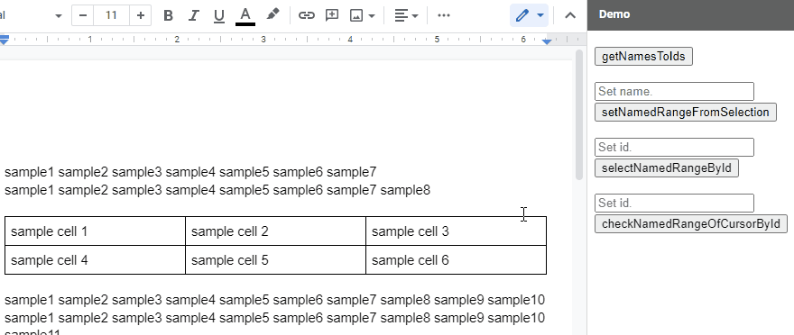

# DocNamedRangeApp

<a name="top"></a>
[](LICENCE)

<a name="overview"></a>

# Overview



This is a Google Apps Script library for managing the named range on Google Documents.

<a name="description"></a>

## Description

Google Document can use the named range. When the named range is used, the users can directly access the contents using the named range. For example, the developer can guide the users to the specific content in Google Documents using the named range. But, unfortunately, in the current stage, it seems that the named range cannot be directly used by the UI on Google Documents. It is required to use Google Apps Script. But, I thought that when I saw the official document of the named range, it might be difficult to understand it. [Ref](https://developers.google.com/apps-script/reference/document/named-range) So, I created this library. When this library is used, the named ranges on Google Documents can be managed.

# Library's project key

```
1ONPDqUOiyJ2RomfPOg69OC5o9yr_F6yT5lU-_oZiT2-pzaKGD_ObGIsl
```

# Methods

| Methods                                                                       | Description                                                                                        |
| :---------------------------------------------------------------------------- | :------------------------------------------------------------------------------------------------- |
| [getAllNamedRanges()](#getAllNamedRanges)                                     | Get all named ranges in Document as an object. ID is the key of object.                            |
| [getNamesToIds()](#getNamesToIds)                                             | Get all named ranges in Document as an object. Name and ID are the key and value, respectively.    |
| [setNamedRangeFromSelection(name, forParagraph)](#setNamedRangeFromSelection) | Set named range by selected contents in Document.                                                  |
| [setNamedRangeFromCursorPosition(name)](#setNamedRangeFromCursorPosition)     | Set named range by cursor position in Document.                                                    |
| [selectNamedRangeById(id)](#selectNamedRangeById)                             | Select a named range by named range ID in Document.                                                |
| [moveCursorToNamedRangesById(id)](#moveCursorToNamedRangesById)               | Move cursor position to the top of named range by ID.                                              |
| [checkNamedRangeOfCursorById(id)](#checkNamedRangeOfCursorById)               | Check whether the current cursor position is included in the named range using the named range ID. |
| [deleteAllNamedRanges()](#deleteAllNamedRanges)                               | Delete all named ranges.                                                                           |
| [deleteNamedRangeById(ids)](#deleteNamedRangeById)                            | Delete named ranges by ID.                                                                         |

## About scopes

This library uses a scope of `https://www.googleapis.com/auth/documents`.

<a name="usage"></a>

# Usage:

## 1. Install library

In order to use this library, please install this library as follows.

1. Create a GAS project.

   - You can use this library for the GAS project of the container-bound script of Google Document.

1. [Install this library](https://developers.google.com/apps-script/guides/libraries).

   - Library's project key is **`1ONPDqUOiyJ2RomfPOg69OC5o9yr_F6yT5lU-_oZiT2-pzaKGD_ObGIsl`**.

# Methods

<a name="getAllNamedRanges"></a>

## getAllNamedRange

This method gets all named ranges in Document as an object. ID is the key of object.

```javascript
const doc = DocumentApp.getActiveDocument();
const res = DocNamedRangeApp.getActiveDocument(doc).getAllNamedRanges();
console.log(res);
```

### Input object

- **doc**: Object of Class Document.

### Output object

This method of `getAllNamedRange` returns the following object.

```json
{
  "###namedRangeId1###": {
    "name": "sample1",
    "namedRange": {},
    "range": {},
    "type": ["###"],
    "rangeElements": [{}]
  },
  "###namedRangeId2###": {
    "name": "sample2",
    "namedRange": {},
    "range": {},
    "type": ["###"],
    "rangeElements": [{}]
  },
  ,
  ,
  ,
}
```

- `name`: Name of named range.
- `namedRange`: Object of named range. [Ref](https://developers.google.com/apps-script/reference/document/named-range)
- `range`: Object of range. [Ref](https://developers.google.com/apps-script/reference/document/range)
- `type`: ElementType. [Ref](https://developers.google.com/apps-script/reference/document/element-type)
- `rangeElements`: Object of RangeElement. [Ref](https://developers.google.com/apps-script/reference/document/range-element)

---

<a name="getNamesToIds"></a>

## getNamesToIds

This method gets all named ranges in Document as an object. Name and ID are the key and value, respectively.

```javascript
const doc = DocumentApp.getActiveDocument();
const res = DocNamedRangeApp.getActiveDocument(doc).getNamesToIds();
console.log(res);
```

### Input object

- **doc**: Object of Class Document.

### Output object

This method of `getNamesToIds` returns the following object.

```json
{
  "sample1": ["###namedRangeId1###"],
  "sample2": ["###namedRangeId2###", "###namedRangeId3###"]
  "sample3": ["###namedRangeId4###", "###namedRangeId5###"]
  ,
  ,
  ,
}
```

- At the Google Document, the same name can be used to the multiple named ranges. So, in this output value, the named range IDs are put in an array.

---

<a name="setNamedRangeFromSelection"></a>

## setNamedRangeFromSelection

This method sets the named range by selected contents in Document. This method can be used for the container-bound script of Google Document.

```javascript
const name = "sampleName";
const doc = DocumentApp.getActiveDocument();
const res =
  DocNamedRangeApp.getActiveDocument(doc).setNamedRangeFromSelection(name);
console.log(res);
```

- In this method, at first, please select the contents on Google Document and please run the script. By this, the selected contents are set as the named range. This demonstration can be seen at the top image.

### Input object

- **doc**: Object of Class Document. Active Document.
- `setNamedRangeFromSelection(name, forParagraph)`
  - This method has 2 arguments.
  - **name**: String. Name of named range you want to create.
  - **forParagraph**: Boolean. The default is `false`. When this is `true`, the paragraph is set as the named range even when the part of text is selected.

### Output object

This method of `setNamedRangeFromSelection` returns the following value.

```
###namedRangeId###
```

- The named range ID of created named range is returned.

---

<a name="setNamedRangeFromCursorPosition"></a>

## setNamedRangeFromCursorPosition

This method sets the named range by cursor position in Document. This method can be used for the container-bound script of Google Document.

```javascript
const name = "sampleName";
const doc = DocumentApp.getActiveDocument();
const res =
  DocNamedRangeApp.getActiveDocument(doc).setNamedRangeFromCursorPosition(name);
console.log(res);
```

- In this method, at first, please put a cursor to the document body and please run the script. By this, the element of the cursor is set as the named range.

### Input object

- **doc**: Object of Class Document. Active Document.
- **name**: Name of named range you want to create. This is string type.

### Output object

This method of `setNamedRangeFromCursorPosition` returns the following value.

```
###namedRangeId###
```

- The named range ID of created named range is returned.

---

<a name="selectNamedRangeById"></a>

## selectNamedRangeById

This method selects a named range by named range ID in Document. This method can be used for the container-bound script of Google Document.

```javascript
const id = "###namedRangeId###";
const doc = DocumentApp.getActiveDocument();
const res = DocNamedRangeApp.getActiveDocument(doc).selectNamedRangeById(id);
console.log(res);
```

- In this method, the range of the named range given by `id` is selected on active Google Document. This demonstration can be seen at the top image.

### Input object

- **doc**: Object of Class Document. Active Document.
- **id**: ID of named range you want to check. This is string type.

### Output object

This method of `selectNamedRangeById` returns the object of Class NamedRange of selected named range.

---

<a name="moveCursorToNamedRangesById"></a>

## moveCursorToNamedRangesById

This method moves the cursor position to the top of named range by ID. This method can be used for the container-bound script of Google Document.

```javascript
const id = "###namedRangeId###";
const doc = DocumentApp.getActiveDocument();
const res =
  DocNamedRangeApp.getActiveDocument(doc).moveCursorToNamedRangesById(id);
console.log(res);
```

- In this method, the cursor position is moved to the top of range of the named range given by `id`.

### Input object

- **doc**: Object of Class Document. Active Document.
- **id**: ID of named range you want to check. This is string type.

### Output object

This method of `moveCursorToNamedRangesById` returns the object of Class NamedRange of selected named range.

---

<a name="checkNamedRangeOfCursorById"></a>

## checkNamedRangeOfCursorById

This method checks whether the current cursor position is included in the named range using the named range ID. This method can be used for the container-bound script of Google Document.

```javascript
const id = "###namedRangeId###";
const doc = DocumentApp.getActiveDocument();
const res =
  DocNamedRangeApp.getActiveDocument(doc).checkNamedRangeOfCursorById(id);
console.log(res);
```

- In this method, at first, please put a cursor to the document body and please run the script. By this, you can see whether the cursor position is inside the named range of the value of `id`. This demonstration can be seen at the top image.

### Input object

- **doc**: Object of Class Document. Active Document.
- **id**: ID of named range you want to check. This is string type.

### Output object

This method of `checkNamedRangeOfCursorById` returns the following value.

```
true
```

or

```
false
```

- When the cursor position is included in the named range, `true` is return. When the cursor position is not included in the named range, `false` is return. By this, you can see whether the cursor position is inside the named range given by `id`.

- I had posted this sample script to [this thread at Stackoverflow](https://stackoverflow.com/a/56970371).

---

<a name="deleteAllNamedRanges"></a>

## deleteAllNamedRanges

This method deletes all named ranges in Google Document.

```javascript
const doc = DocumentApp.getActiveDocument();
const res = DocNamedRangeApp.getActiveDocument(doc).deleteAllNamedRanges();
console.log(res);
```

### Input object

- **doc**: Object of Class Document. Active Document.

### Output object

This method of `deleteAllNamedRanges` returns no value.

---

<a name="deleteNamedRangeById"></a>

## deleteNamedRangeById

This method deletes all named ranges in Google Document.

```javascript
const ids = ["###namedRangeId1###", "###namedRangeId3###", , ,];
const doc = DocumentApp.getActiveDocument();
const res = DocNamedRangeApp.getActiveDocument(doc).deleteNamedRangeById(ids);
console.log(res);
```

### Input object

- **doc**: Object of Class Document. Active Document.
- **ids**: String[] Named range IDs you want to delete.

### Output object

This method of `deleteNamedRangeById` returns the following object.

```json
{ "success": ["###namedRangeId1###"], "failure": ["###namedRangeId3###"] }
```

- `success`: ID that the named range can be removed.
- `failure`: ID that the named range cannot be removed, because the ID was not found in the active Document.

# IMPORTANT

- **This library uses V8 runtime. So please enable V8 at the script editor.**

---

<a name="licence"></a>

# Licence

[MIT](LICENCE)

<a name="author"></a>

# Author

[Tanaike](https://tanaikech.github.io/about/)

<a name="updatehistory"></a>

# Update History

- v1.0.0 (May 1, 2022)

  1. Initial release.

[TOP](#top)
